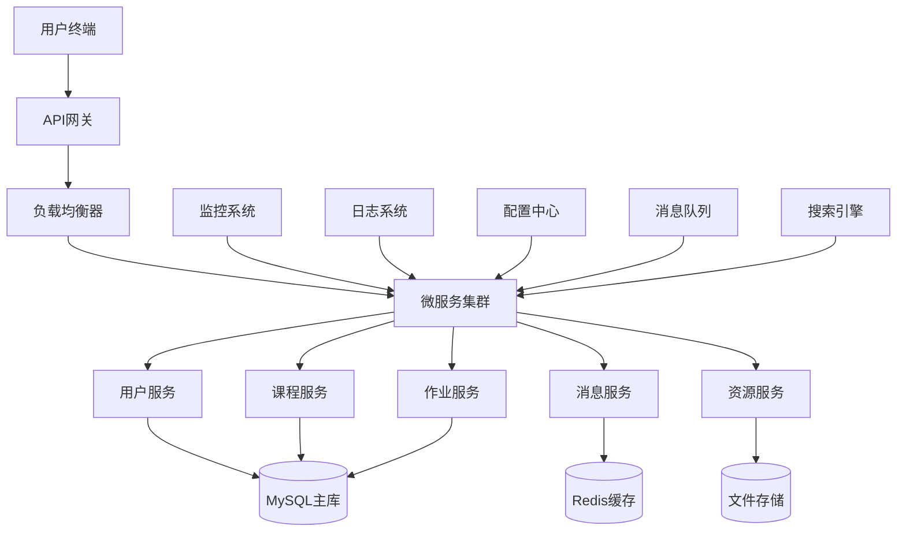

# 智慧教育平台系统架构设计方案

## 1. 架构概述

### 1.1 设计理念
采用微服务架构设计，遵循高内聚低耦合原则，构建可扩展、高可用、易维护的智慧教育平台。

### 1.2 架构目标
- **高性能**：支持大规模并发访问
- **高可用**：99.9%系统可用性保证
- **可扩展**：支持业务快速迭代和横向扩展
- **安全性**：完善的安全防护机制
- **可观测性**：全面的监控和日志体系

## 2. 整体架构设计

### 2.1 架构层次划分

```
┌─────────────────────────────────────────────────────────────┐
│                        表示层 (Presentation Layer)           │
├─────────────────────────────────────────────────────────────┤
│  Web前端    │   移动端APP   │   管理后台   │   第三方集成  │
├─────────────────────────────────────────────────────────────┤
│                        应用层 (Application Layer)            │
├─────────────────────────────────────────────────────────────┤
│  用户服务  │  课程服务  │  作业服务  │  消息服务  │  资源服务 │
├─────────────────────────────────────────────────────────────┤
│                        业务层 (Business Layer)               │
├─────────────────────────────────────────────────────────────┤
│      业务逻辑处理      │      数据访问封装      │      公共组件      │
├─────────────────────────────────────────────────────────────┤
│                        数据层 (Data Layer)                   │
├─────────────────────────────────────────────────────────────┤
│  关系数据库  │  缓存系统  │  文件存储  │  搜索引擎  │  消息队列  │
└─────────────────────────────────────────────────────────────┘
```

### 2.2 技术架构图



## 3. 核心组件设计

### 3.1 API网关层
**组件名称**：API Gateway
**技术选型**：Spring Cloud Gateway
**主要职责**：
- 统一入口和路由转发
- 身份认证和权限校验
- 请求限流和熔断保护
- 协议转换和参数校验
- 日志记录和监控埋点

### 3.2 微服务层

#### 3.2.1 用户服务 (User Service)
**服务功能**：
- 用户注册、登录、认证
- 个人信息管理
- 权限角色管理
- 用户状态监控

**技术栈**：
- Spring Boot 2.7.x
- Spring Security
- JWT Token
- MyBatis Plus

#### 3.2.2 课程服务 (Course Service)
**服务功能**：
- 课程创建和管理
- 课时安排和调度
- 课程资源管理
- 学习进度跟踪

**技术栈**：
- Spring Boot
- Quartz Scheduler
- Elasticsearch
- FFmpeg

#### 3.2.3 作业服务 (Assignment Service)
**服务功能**：
- 作业布置和回收
- 自动批改和人工批改
- 成绩统计分析
- 作业模板管理

**技术栈**：
- Spring Boot
- Apache POI
- OpenCV (图像识别)
- Drools (规则引擎)

#### 3.2.4 消息服务 (Message Service)
**服务功能**：
- 实时消息推送
- 系统通知管理
- 消息模板配置
- 消息历史查询

**技术栈**：
- WebSocket
- RabbitMQ
- Netty
- Redis Pub/Sub

#### 3.2.5 资源服务 (Resource Service)
**服务功能**：
- 教学资源上传管理
- 资源分类和检索
- CDN内容分发
- 资源权限控制

**技术栈**：
- FastDFS/MinIO
- Nginx
- Elasticsearch
- FFmpeg

### 3.3 数据存储层

#### 3.3.1 关系数据库
**选型**：MySQL 8.0
**用途**：存储结构化业务数据
**部署**：
- 主从复制架构
- 读写分离
- 定期备份策略
- 数据库连接池配置

#### 3.3.2 缓存系统
**选型**：Redis 6.x
**用途**：热点数据缓存、会话存储
**部署**：
- 集群模式部署
- 数据持久化配置
- 内存淘汰策略
- 监控告警机制

#### 3.3.3 文件存储
**选型**：分布式文件系统
**用途**：存储课件、视频、图片等大文件
**特性**：
- 高可用性保证
- 自动扩容能力
- CDN加速支持
- 断点续传功能

### 3.4 中间件层

#### 3.4.1 消息队列
**选型**：RabbitMQ
**用途**：异步处理、解耦服务
**应用场景**：
- 邮件短信发送
- 日志异步处理
- 数据同步任务
- 事件驱动架构

#### 3.4.2 搜索引擎
**选型**：Elasticsearch
**用途**：全文检索、数据分析
**应用场景**：
- 课程资源搜索
- 用户行为分析
- 日志检索分析
- 实时数据统计

## 4. 技术栈详细选型

### 4.1 后端技术栈

| 组件 | 技术选型 | 版本 | 选型理由 |
|------|----------|------|----------|
| 开发框架 | Spring Boot | 2.7.10 | 生态完善，开发效率高 |
| 微服务 | Spring Cloud | 2021.0.6 | 成熟的微服务解决方案 |
| 数据库ORM | MyBatis Plus | 3.5.3 | 简化数据库操作 |
| 安全框架 | Spring Security | 5.7.7 | 完善的安全控制 |
| 缓存框架 | Spring Data Redis | 2.7.10 | 集成度高 |
| 消息队列 | RabbitMQ | 3.11.0 | 可靠性高，功能丰富 |

### 4.2 前端技术栈

| 组件 | 技术选型 | 版本 | 选型理由 |
|------|----------|------|----------|
| 框架 | Vue.js | 3.2.x | 响应式，组件化 |
| UI库 | Element Plus | 2.3.x | 组件丰富，文档完善 |
| 状态管理 | Pinia | 2.0.x | Vue3官方推荐 |
| HTTP客户端 | Axios | 1.3.x | 功能强大，拦截器支持 |
| 构建工具 | Vite | 4.2.x | 构建速度快 |

### 4.3 运维技术栈

| 组件 | 技术选型 | 用途 |
|------|----------|------|
| 容器化 | Docker | 应用容器化部署 |
| 编排工具 | Kubernetes | 容器编排管理 |
| 监控系统 | Prometheus + Grafana | 系统监控告警 |
| 日志系统 | ELK Stack | 日志收集分析 |
| 配置中心 | Nacos | 统一配置管理 |
| 服务注册 | Nacos/Eureka | 服务发现注册 |

## 5. 数据库设计

### 5.1 核心数据表设计

#### 5.1.1 用户相关表

```sql
-- 用户基本信息表
CREATE TABLE edu_user (
    user_id BIGINT PRIMARY KEY AUTO_INCREMENT COMMENT '用户ID',
    username VARCHAR(50) UNIQUE NOT NULL COMMENT '用户名',
    password VARCHAR(100) NOT NULL COMMENT '密码',
    real_name VARCHAR(50) NOT NULL COMMENT '真实姓名',
    phone VARCHAR(20) UNIQUE COMMENT '手机号',
    email VARCHAR(100) COMMENT '邮箱',
    user_type TINYINT NOT NULL COMMENT '用户类型：1-学生 2-教师 3-家长 4-管理员',
    status TINYINT DEFAULT 1 COMMENT '状态：0-禁用 1-启用',
    avatar VARCHAR(200) COMMENT '头像URL',
    created_time DATETIME DEFAULT CURRENT_TIMESTAMP COMMENT '创建时间',
    updated_time DATETIME DEFAULT CURRENT_TIMESTAMP ON UPDATE CURRENT_TIMESTAMP COMMENT '更新时间'
);

-- 用户角色关联表
CREATE TABLE edu_user_role (
    id BIGINT PRIMARY KEY AUTO_INCREMENT,
    user_id BIGINT NOT NULL COMMENT '用户ID',
    role_id BIGINT NOT NULL COMMENT '角色ID',
    created_time DATETIME DEFAULT CURRENT_TIMESTAMP,
    FOREIGN KEY (user_id) REFERENCES edu_user(user_id),
    FOREIGN KEY (role_id) REFERENCES edu_role(role_id)
);

-- 角色权限表
CREATE TABLE edu_role_permission (
    id BIGINT PRIMARY KEY AUTO_INCREMENT,
    role_id BIGINT NOT NULL COMMENT '角色ID',
    permission_id BIGINT NOT NULL COMMENT '权限ID',
    created_time DATETIME DEFAULT CURRENT_TIMESTAMP,
    FOREIGN KEY (role_id) REFERENCES edu_role(role_id),
    FOREIGN KEY (permission_id) REFERENCES edu_permission(permission_id)
);
```

#### 5.1.2 课程相关表

```sql
-- 课程表
CREATE TABLE edu_course (
    course_id BIGINT PRIMARY KEY AUTO_INCREMENT COMMENT '课程ID',
    course_name VARCHAR(100) NOT NULL COMMENT '课程名称',
    course_code VARCHAR(50) UNIQUE NOT NULL COMMENT '课程编码',
    description TEXT COMMENT '课程描述',
    teacher_id BIGINT NOT NULL COMMENT '授课教师ID',
    grade_level TINYINT NOT NULL COMMENT '年级',
    subject_id BIGINT NOT NULL COMMENT '学科ID',
    credit DECIMAL(3,1) DEFAULT 0 COMMENT '学分',
    status TINYINT DEFAULT 1 COMMENT '状态：0-停用 1-启用',
    cover_image VARCHAR(200) COMMENT '封面图片',
    created_time DATETIME DEFAULT CURRENT_TIMESTAMP,
    updated_time DATETIME DEFAULT CURRENT_TIMESTAMP ON UPDATE CURRENT_TIMESTAMP,
    FOREIGN KEY (teacher_id) REFERENCES edu_user(user_id),
    FOREIGN KEY (subject_id) REFERENCES edu_subject(subject_id)
);

-- 课时表
CREATE TABLE edu_lesson (
    lesson_id BIGINT PRIMARY KEY AUTO_INCREMENT COMMENT '课时ID',
    course_id BIGINT NOT NULL COMMENT '课程ID',
    lesson_title VARCHAR(100) NOT NULL COMMENT '课时标题',
    lesson_order INT NOT NULL COMMENT '课时序号',
    content LONGTEXT COMMENT '课时内容',
    video_url VARCHAR(200) COMMENT '视频地址',
    duration INT COMMENT '时长(分钟)',
    status TINYINT DEFAULT 1 COMMENT '状态',
    created_time DATETIME DEFAULT CURRENT_TIMESTAMP,
    updated_time DATETIME DEFAULT CURRENT_TIMESTAMP ON UPDATE CURRENT_TIMESTAMP,
    FOREIGN KEY (course_id) REFERENCES edu_course(course_id)
);
```

#### 5.1.3 作业相关表

```sql
-- 作业表
CREATE TABLE edu_assignment (
    assignment_id BIGINT PRIMARY KEY AUTO_INCREMENT COMMENT '作业ID',
    course_id BIGINT NOT NULL COMMENT '课程ID',
    teacher_id BIGINT NOT NULL COMMENT '教师ID',
    title VARCHAR(100) NOT NULL COMMENT '作业标题',
    content TEXT COMMENT '作业内容',
    deadline DATETIME NOT NULL COMMENT '截止时间',
    assign_time DATETIME DEFAULT CURRENT_TIMESTAMP COMMENT '布置时间',
    status TINYINT DEFAULT 1 COMMENT '状态：0-草稿 1-发布 2-结束',
    FOREIGN KEY (course_id) REFERENCES edu_course(course_id),
    FOREIGN KEY (teacher_id) REFERENCES edu_user(user_id)
);

-- 学生作业提交表
CREATE TABLE edu_student_assignment (
    submit_id BIGINT PRIMARY KEY AUTO_INCREMENT COMMENT '提交ID',
    assignment_id BIGINT NOT NULL COMMENT '作业ID',
    student_id BIGINT NOT NULL COMMENT '学生ID',
    content TEXT COMMENT '提交内容',
    attachment_url VARCHAR(200) COMMENT '附件地址',
    submit_time DATETIME DEFAULT CURRENT_TIMESTAMP COMMENT '提交时间',
    score DECIMAL(5,2) COMMENT '得分',
    feedback TEXT COMMENT '教师评语',
    status TINYINT DEFAULT 0 COMMENT '状态：0-未提交 1-已提交 2-已批改',
    FOREIGN KEY (assignment_id) REFERENCES edu_assignment(assignment_id),
    FOREIGN KEY (student_id) REFERENCES edu_user(user_id)
);
```

### 5.2 数据库索引策略
- 主键索引：所有表的主键字段
- 唯一索引：用户名、手机号、邮箱等唯一字段
- 复合索引：经常联合查询的字段组合
- 全文索引：搜索相关的文本字段

## 6. API接口设计规范

### 6.1 RESTful API设计原则
- 使用HTTP动词表示操作类型
- URI资源命名采用名词复数形式
- 返回统一的JSON格式
- 状态码符合HTTP标准

### 6.2 接口响应格式

```json
{
    "code": 200,
    "message": "success",
    "data": {},
    "timestamp": "2026-03-11T17:45:00Z"
}
```

### 6.3 核心API示例

#### 6.3.1 用户认证接口
```
POST /api/auth/login
请求参数：{username: "test", password: "123456"}
响应：{token: "jwt_token", userInfo: {}}
```

#### 6.3.2 课程管理接口
```
GET /api/courses?page=1&size=10
POST /api/courses
PUT /api/courses/{id}
DELETE /api/courses/{id}
```

#### 6.3.3 作业管理接口
```
GET /api/assignments?courseId=1
POST /api/assignments
GET /api/assignments/{id}/submissions
```

## 7. 安全架构设计

### 7.1 认证授权体系
- **JWT Token**：无状态认证机制
- **OAuth2.0**：第三方认证集成
- **RBAC权限模型**：基于角色的访问控制
- **API签名**：防止请求篡改

### 7.2 数据安全措施
- **传输加密**：HTTPS/TLS 1.3
- **数据加密**：敏感字段AES加密
- **SQL防注入**：参数化查询
- **XSS防护**：输入输出过滤

### 7.3 安全监控
- **异常登录检测**：IP地域、时间频率分析
- **操作日志审计**：关键操作全程记录
- **漏洞扫描**：定期安全检测
- **应急响应**：安全事件处置流程

## 8. 性能优化策略

### 8.1 缓存策略
- **本地缓存**：Caffeine缓存热点数据
- **分布式缓存**：Redis缓存会话和查询结果
- **CDN加速**：静态资源CDN分发
- **浏览器缓存**：合理设置缓存头

### 8.2 数据库优化
- **读写分离**：主库写入，从库读取
- **分库分表**：大表按业务维度拆分
- **索引优化**：合理的索引设计
- **连接池**：数据库连接池管理

### 8.3 应用层优化
- **异步处理**：耗时操作异步执行
- **批量操作**：减少数据库交互次数
- **压缩传输**：GZIP压缩响应数据
- **懒加载**：按需加载数据

## 9. 部署架构

### 9.1 开发环境
- 单机部署
- Docker容器化
- 本地数据库
- 热部署支持

### 9.2 测试环境
- 与生产环境一致的配置
- 自动化测试集成
- 性能压测环境
- 安全扫描环境

### 9.3 生产环境
```
┌─────────────────────────────────────────────────────────────┐
│                    负载均衡层 (Load Balancer)                │
│                         Nginx Cluster                       │
├─────────────────────────────────────────────────────────────┤
│                    应用服务层 (Application Servers)          │
│                   Kubernetes Pod Cluster                    │
├─────────────────────────────────────────────────────────────┤
│                    数据存储层 (Data Storage)                 │
│       MySQL Master-Slave  │  Redis Cluster  │  File Storage │
├─────────────────────────────────────────────────────────────┤
│                    监控运维层 (Monitoring & Ops)             │
│    Prometheus  │  Grafana  │  ELK  │  Jenkins  │  GitLab   │
└─────────────────────────────────────────────────────────────┘
```

## 10. 监控告警体系

### 10.1 应用监控
- **JVM监控**：内存、GC、线程状态
- **接口监控**：响应时间、成功率、QPS
- **业务监控**：关键业务指标追踪
- **日志监控**：错误日志实时告警

### 10.2 系统监控
- **服务器监控**：CPU、内存、磁盘、网络
- **数据库监控**：连接数、慢查询、锁等待
- **中间件监控**：Redis、RabbitMQ状态
- **容器监控**：Pod状态、资源使用率

## 11. 灾备方案

### 11.1 数据备份
- **定时备份**：每日全量备份
- **增量备份**：每小时增量备份
- **异地备份**：多地存储备份数据
- **备份验证**：定期恢复测试

### 11.2 故障切换
- **主从切换**：数据库主从自动切换
- **服务降级**：非核心功能降级处理
- **熔断机制**：异常服务快速熔断
- **限流策略**：高峰期流量控制

---

**文档版本**：V1.0  
**编制日期**：2026年3月  
**编制人**：架构师AI  
**审核人**：技术总监